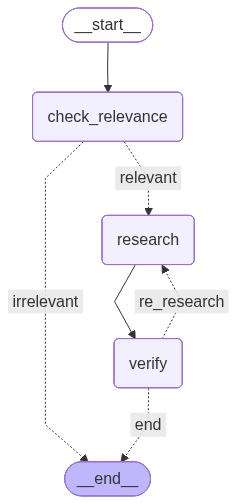

# Document Chat
A **RAG-based agentic AI** app powered by `LangGraph` and `Docling`, using `ChromaDB` for serverless vector storage. **Hybrid search** retrieves the most relevant content to generate accurate answers from your documents.

Ask questions about your documents to explore them in depth.



**Demo:** https://huggingface.co/spaces/Azam-Rabiee/doc_chat

# Create and Activate Environment

### Option 1: Using `uv` (Recommended)

`uv` is a fast Python package and environment manager.

#### 1. Install `uv` (if not already installed)

```bash
curl -LsSf https://astral.sh/uv/install.sh | sh
```

Restart your terminal after installation.

#### 2. Create the virtual environment

```bash
uv venv .venv
```

#### 3. Activate the environment

```bash
# macOS / Linux
source .venv/bin/activate
# Windows (PowerShell)
.venv\Scripts\Activate.ps1
```

#### 4. Install dependencies (from lock file)

```bash
uv sync
```

> This installs exact, reproducible versions from `uv.lock`.

---

### Option 2: Using `pip`

Use this if you don’t want to install `uv`.

#### 1. Create the virtual environment

```bash
python -m venv .venv
```

#### 2. Activate the environment

```bash
# macOS / Linux
source .venv/bin/activate
# Windows (PowerShell)
.venv\Scripts\Activate.ps1
```

#### 3. Upgrade core tooling

```bash
python -m pip install --upgrade pip setuptools wheel
```

#### 4. Install dependencies

```bash
pip install -r requirements.txt
```

---

### Verify Installation

```bash
python --version
pip list
```

---

### Deactivate the environment

```bash
deactivate
```

# Run the app
```
source .venv/bin/activate
python app.py
```

## Run a single test
For example for `test_files_api_info_generation`
```
python -m pytest tests/document_processor/file_upload.py::test_files_api_info_generation
```